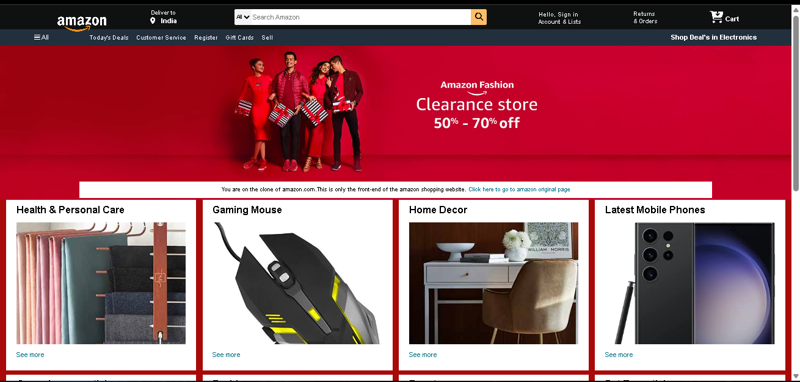
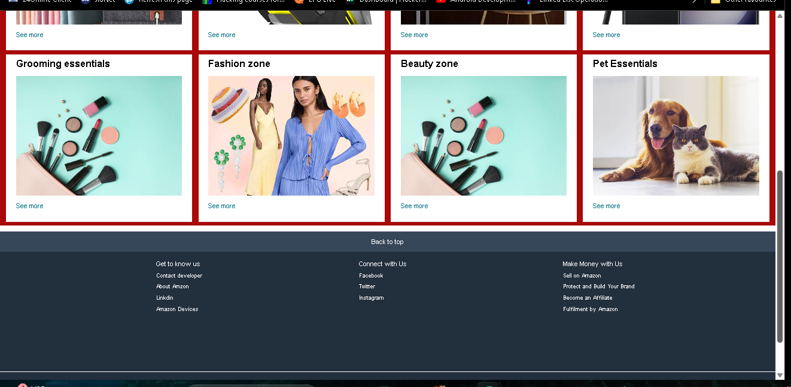

# Amazon Front-End Clone
<h3>Site is live at : https://blackycode50.github.io/Amazon_Clone/
</h3>
<table>
  <tr>
    <td style="object-fit: cover;"></td>
    <td style="object-fit: cover;"></td>
  </tr>
</table>
This project is a static front-end clone of the Amazon shopping website. It's important to note that this clone is not responsive and may not provide an optimal viewing experience on all devices. The primary goal of this project is to showcase HTML and CSS skills in replicating a real-world website.fdgmj

## Demo


## Technologies Used

- HTML
- CSS
- Font Awesome (for icons)


1. Clone the repository:

   ```bash
   git clone https://github.com/BlAcKyCoDe50/Amazon_Clone
